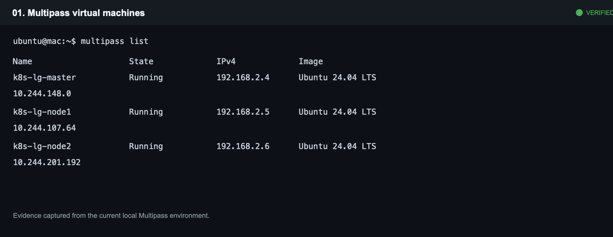
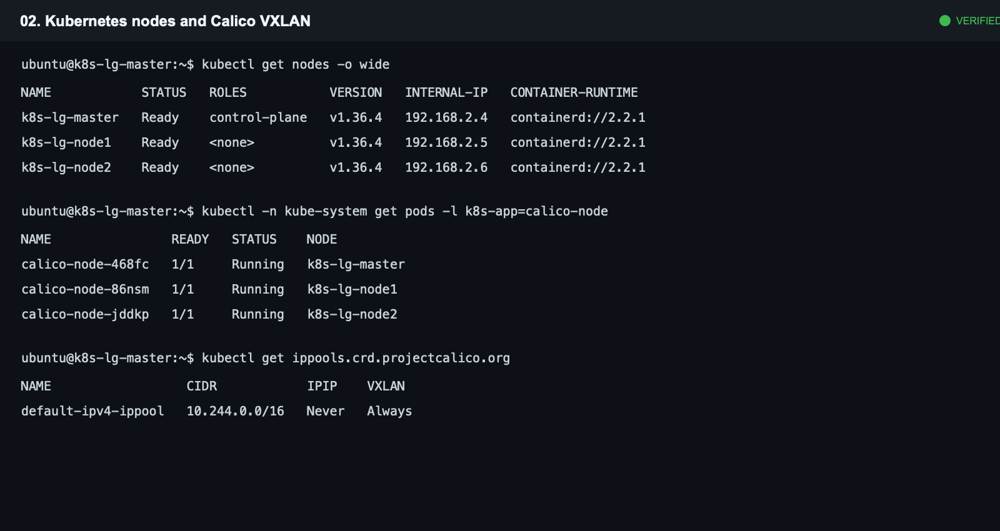
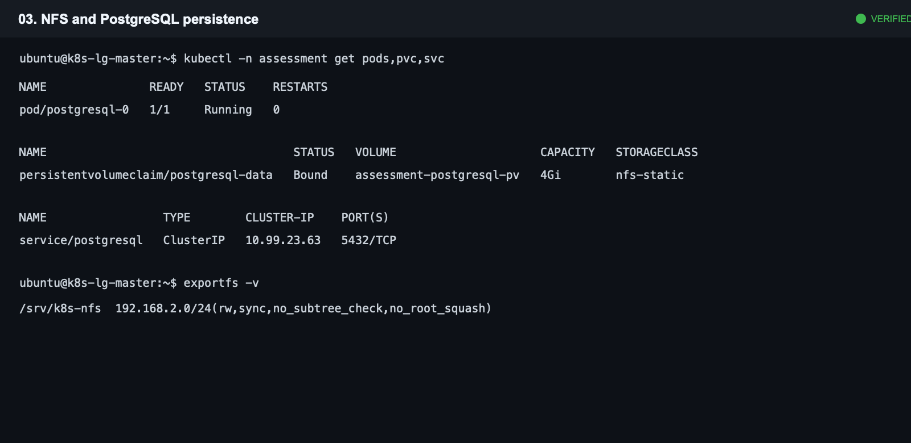
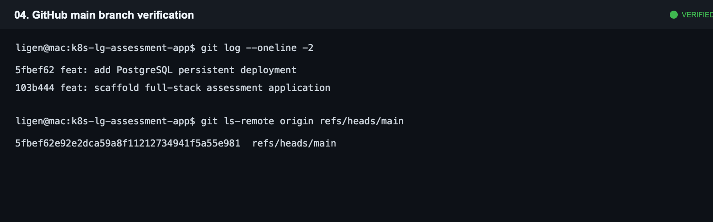

# Kubernetes 全栈考核作业记录

> 更新日期：2026-08-22  
> 项目仓库：[Ligen-gycx/k8s-lg-assessment-app](https://github.com/Ligen-gycx/k8s-lg-assessment-app)

## 1. 作业目标

使用本机 Multipass 创建三台 Ubuntu 虚拟机，搭建 Kubernetes 集群，并建立 Java 全栈应用的基础交付链路。当前已完成基础设施、Kubernetes 网络、NFS 持久化 PostgreSQL、GitHub SSH 授权、代码入库、第二阶段平台部署，以及第三阶段应用 Helm 发布和端到端数据验收。

## 2. 当前架构

| 项目 | 当前实现 |
| --- | --- |
| 本机 | Apple Silicon Mac，Multipass `1.16.1+mac` |
| 控制平面 | `k8s-lg-master`，`192.168.2.4` |
| 工作节点 | `k8s-lg-node1`，`192.168.2.5`；`k8s-lg-node2`，`192.168.2.6` |
| Kubernetes | `v1.36.4`，containerd `2.2.1`，ARM64 |
| Pod 网络 | Calico `v3.31.3`，`10.244.0.0/16`，VXLAN，IPIP/BGP 关闭 |
| 持久化 | 控制平面 NFS Server，静态 NFS PV/PVC |
| 数据库 | PostgreSQL 17 StatefulSet，`assessment` 命名空间 |
| Ingress | Traefik v3.3，部署于 `k8s-lg-node2`，NodePort `30080` |
| CI | Jenkins LTS JDK 17，部署于 `k8s-lg-node1`，6Gi NFS PVC |
| 构建服务 | Rootless BuildKit v0.17.3，部署于 `k8s-lg-node1` |
| 代码 | React/Vite 前端、Spring Boot 3/Java 21 后端、PostgreSQL/Flyway、Helm Chart、Jenkinsfile |

## 3. 已完成步骤

### 3.1 创建虚拟机

创建三台 Ubuntu 24.04 LTS 虚拟机，并完成 containerd、kubelet、kubeadm、kubectl、NFS 客户端等基础组件安装。

验证命令：

```bash
multipass list
```

验证结果：三个实例均为 `Running`。



### 3.2 初始化 Kubernetes 集群

在控制平面通过 `kubeadm init` 初始化集群，配置：

- API Server：`192.168.2.4`
- Service CIDR：`10.96.0.0/12`
- Pod CIDR：`10.244.0.0/16`

随后使用 `kubeadm join` 将两个工作节点加入集群。最终三个节点均为 `Ready`。

### 3.3 部署 Calico VXLAN 网络

部署 Calico `v3.31.3`，使用可访问的镜像镜像源。为匹配本次最低资源虚拟机方案，网络模式使用 VXLAN，并明确关闭 IPIP 和 BGP。

验证命令：

```bash
kubectl get nodes -o wide
kubectl -n kube-system get pods -l k8s-app=calico-node -o wide
kubectl get ippools.crd.projectcalico.org \
  -o custom-columns=NAME:.metadata.name,CIDR:.spec.cidr,IPIP:.spec.ipipMode,VXLAN:.spec.vxlanMode
```

验证结果：3 个 Node 均为 `Ready`，3 个 `calico-node` 均为 `1/1 Running`，默认 IPPool 为 `10.244.0.0/16`、`IPIP=Never`、`VXLAN=Always`。



### 3.4 配置 NFS 与 PostgreSQL 持久化

在 `k8s-lg-master` 启用 NFS Server，并将 `/srv/k8s-nfs` 限制导出给 `192.168.2.0/24` 集群网段。部署 PostgreSQL 17 StatefulSet、ClusterIP Service 和 4Gi 静态 NFS PVC。

验证命令：

```bash
kubectl -n assessment get pods,pvc,svc
exportfs -v
```

验证结果：`postgresql-0` 为 `1/1 Running`，`postgresql-data` PVC 为 `Bound`，数据库服务通过 `5432/TCP` 提供集群内访问。



### 3.5 GitHub SSH 授权与代码入库

在 GitHub 账户级 SSH Keys 中添加本机 `id_rsa.pub`，并通过 `ssh-add --apple-use-keychain ~/.ssh/id_rsa` 解锁本机私钥。仓库远程地址使用 SSH：

```text
git@github.com:Ligen-gycx/k8s-lg-assessment-app.git
```

已推送的 `main` 分支提交：

```text
103b444 feat: scaffold full-stack assessment application
5fbef62 feat: add PostgreSQL persistent deployment
```



### 3.6 第二阶段：部署入口、CI 与构建平台

本阶段使用三个可复现清单：`platform/traefik.yaml`、`platform/jenkins.yaml`、`platform/buildkit.yaml`。所有服务使用 ARM64 可运行镜像，并按低资源集群限制固定调度到工作节点。

#### Traefik 统一入口

- Traefik v3.3 固定调度到 `k8s-lg-node2`，资源请求为 `50m CPU / 64Mi`，限制为 `250m CPU / 128Mi`。
- 使用 `traefik` IngressClass 和 NodePort `30080` 提供 HTTP 入口。
- ServiceAccount 只拥有读取 Service、Endpoint、EndpointSlice、Secret、Node 和 Ingress 的权限。
- Jenkins 已通过 `jenkins.192.168.2.6.nip.io` 路由接入该入口：`http://jenkins.192.168.2.6.nip.io:30080/`。

#### Jenkins 与 NFS 持久化

- Jenkins LTS JDK 17 固定调度到 `k8s-lg-node1`，资源请求为 `250m CPU / 512Mi`，限制为 `1 CPU / 1Gi`。
- `jenkins-home` PVC 已绑定到 6Gi 静态 NFS PV，重建 Pod 后 Jenkins 配置可保留。
- 创建 `assessment/jenkins-deployer` ServiceAccount，其 Role 仅允许对应用所需的 Deployment、ReplicaSet、Service、ConfigMap 和 Ingress 做读取、创建、更新和 patch，不授予 Secret 删除或集群级权限。

#### Rootless BuildKit

- Rootless BuildKit v0.17.3 固定调度到 `k8s-lg-node1`，以 UID/GID `1000` 运行，不使用 privileged 容器、不挂载 Docker Socket。
- BuildKit 的 `newuidmap` 仅用于 RootlessKit 创建用户命名空间；该能力是 rootless 构建所必需，其他容器权限保持受限。
- 已使用 `buildctl debug workers` 验证可返回 `linux/arm64` worker。

验收命令：

```bash
kubectl get nodes
kubectl get pods -A
kubectl -n ci get pvc jenkins-home
kubectl auth can-i patch deployments \
  --as=system:serviceaccount:assessment:jenkins-deployer -n assessment
kubectl auth can-i delete secrets \
  --as=system:serviceaccount:assessment:jenkins-deployer -n assessment
kubectl -n build exec deployment/buildkitd -- \
  buildctl --addr tcp://127.0.0.1:1234 debug workers
curl -H 'Host: jenkins.192.168.2.6.nip.io' \
  http://192.168.2.6:30080/
```

验收结果：三个 Node 均为 `Ready`；Traefik、Jenkins、BuildKit 与 PostgreSQL 均为 `Running`；`jenkins-home` PVC 为 `Bound`；RBAC 检查结果为 `patch deployments=yes`、`delete secrets=no`；BuildKit 返回 ARM64 worker；经 Traefik 访问 Jenkins 返回 `403`，这是 Jenkins 未登录状态下的预期响应，证明入口已成功代理到 Jenkins。

### 3.7 第三阶段：应用发布与端到端验收

#### 镜像与 Helm 发布

- 将 Dockerfile 基础镜像切换到可访问的 DaoCloud 镜像代理；后端使用 Maven 公共镜像完成依赖下载。
- 为 Flyway 11 显式加入 `flyway-database-postgresql` 模块，使 Spring Boot 可识别 PostgreSQL 17。
- 前端与后端均构建为 ARM64 镜像；本次 VM 验证以提交 `60b3f35` 作为镜像标签。
- 镜像导入到对应工作节点的 containerd：API 固定在 `k8s-lg-node1`，Web 固定在 `k8s-lg-node2`，使用 `imagePullPolicy: IfNotPresent`，无需在本阶段暴露或保存 GHCR 凭据。
- 使用 Helm `assessment-app` Release 发布到 `assessment` 命名空间；当前为 Revision `3`、状态 `deployed`。

#### 稳定性与数据验证

- Spring Boot 首次启动包含连接池初始化与 Flyway 迁移，约需 60 秒；Chart 使用 `startupProbe` 提供最多 150 秒的启动窗口，避免 livenessProbe 过早重启容器。
- Flyway 已创建 `flyway_schema_history` 并执行 `V1__create_tasks.sql`，初始化任务数据可由 API 返回。
- 业务入口：`http://app.192.168.2.6.nip.io:30080/`。
- 验收时经 Traefik -> Nginx -> Spring Boot 创建 `Phase 3 deployment verified` 任务；随后通过 `GET /api/tasks` 读取，并在 PostgreSQL `tasks` 表中确认同一条记录存在。

验收命令：

```bash
kubectl -n assessment get deploy,pods,svc,ingress
helm -n assessment status assessment-app
curl -H 'Host: app.192.168.2.6.nip.io' \
  http://192.168.2.6:30080/
curl -H 'Host: app.192.168.2.6.nip.io' \
  http://192.168.2.6:30080/api/tasks
```

验收结果：`assessment-api`、`assessment-web`、`postgresql-0` 均为 `1/1 Running`；业务页面返回 `200 OK`；任务创建、列表读取和 PostgreSQL 持久化数据一致。

## 4. 已实现的应用代码

- `frontend/`：React/Vite 任务看板，已通过 `npm run build`。
- `backend/`：Spring Boot 3、Java 21、Maven、Flyway、PostgreSQL。
- 后端接口：`GET /api/tasks`、`POST /api/tasks`、`/actuator/health`。
- `frontend/Dockerfile` 与 `backend/Dockerfile`：前后端容器化，其中后端以非 root 用户运行。
- `deploy/charts/assessment-app/`：前端、后端 Deployment/Service/Ingress 的 Helm Chart 模板。
- `platform/postgresql.yaml`：不含密码的 PostgreSQL/NFS 可复现部署清单；运行密码仅存储于 Kubernetes Secret。
- `Jenkinsfile`：Maven、前端构建和 Helm lint 的基础流水线定义；实际 GHCR 推送与自动发布待配置 Jenkins 凭据后启用。

## 5. 后续实施项

1. 在 Jenkins 中安装所需插件并配置 GitHub、GHCR 与 Kubernetes 凭据。
2. 完成 Jenkins 中的 Maven 测试、Rootless BuildKit 构建、GHCR 推送和自动 Helm 发布。
3. 验证 Jenkins 自动发布后的回滚流程，并补充流水线运行截图。

## 6. 证据说明

`evidence/` 下的 PNG 为当前环境真实命令输出生成的终端证据图。由于 macOS 未授予终端截屏权限，未使用显示器物理截屏；图中的节点、Pod、PVC 和 Git 提交数据均来自本次实际验证命令。
