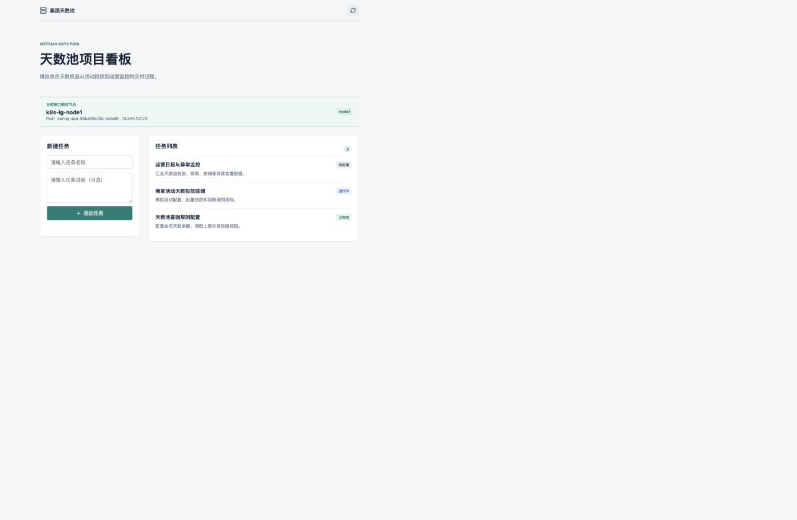

# 虚拟机培训应用入口验证（1-13）

验证日期：2026-08-24

本次仅部署培训要求的 `app.k8s.lab` 应用入口。`jenkins.k8s.lab`、`headlamp.k8s.lab` 仅保留本机 hosts 解析，不恢复对应工作负载。

## 入口与页面

- HTTPS 入口：`https://app.k8s.lab:30443/`
- 健康检查：`https://app.k8s.lab:30443/actuator/health`
- 页面功能：美团天数池任务列表、新建任务、当前 API 响应节点。
- 浏览器已验证 HTTPS 页面正常加载；页面请求先后命中 `k8s-lg-node1` 与 `k8s-lg-node2-recovery`。



## 1-13 验证结果

| 步骤 | 验证结果 |
| --- | --- |
| 1. 三个培训域名解析 | `192.168.2.8 jenkins.k8s.lab app.k8s.lab headlamp.k8s.lab` 已写入本机 hosts。 |
| 2. 浏览器确认 | `https://app.k8s.lab:30443/` 已显示天数池项目看板、3 条任务数据和响应节点。 |
| 3. NodePort | Traefik `websecure`：`servicePort=30443`、`targetPort=websecure`、`nodePort=30443`。 |
| 4. Traefik Pod 端口 | `websecure containerPort=8443`。 |
| 5. TLS 入口 | 参数包含 `--entryPoints.websecure.address=:8443/tcp` 与 `--entryPoints.websecure.http.tls=true`。 |
| 6. Ingress 宽表 | `spring-app`、`CLASS=traefik`、`HOSTS=app.k8s.lab`、`PORTS=80,443`。 |
| 7. Ingress 明细 | `host=app.k8s.lab backend=spring-app:8080 tlsHost=app.k8s.lab tlsSecret=k8s-lab-tls`。 |
| 8. 内部 Service | `spring-app` 为 `ClusterIP:8080`；`postgresql` 为 `ClusterIP:5432`。 |
| 9. Service Selector | `{"app.kubernetes.io/name":"spring-app"}`。 |
| 10. 被选中 Pod | 两个就绪 Pod：一个在 `k8s-lg-node1`，一个在 `k8s-lg-node2-recovery`。 |
| 11. EndpointSlice | `spring-app-2x5fk` 维护两个 Endpoint：`10.244.107.72`、`10.244.252.8`。 |
| 12. 端口一致性 | EndpointSlice `port=8080 name=http`，与 API 容器 `http:8080` 一致。 |
| 13. 入口健康检查 | 使用内部 CA 校验 HTTPS，返回 `{"status":"UP","groups":["liveness","readiness"]}`。 |

## 结果结构

```text
app.k8s.lab:30443
  -> Traefik NodePort 30443
  -> websecure:8443 (TLS)
  -> Ingress spring-app
  -> Service spring-app:8080 (ClusterIP)
  -> 2 x spring-app Pod (node1 / node2-recovery)
  -> PostgreSQL:5432 (ClusterIP)
```
